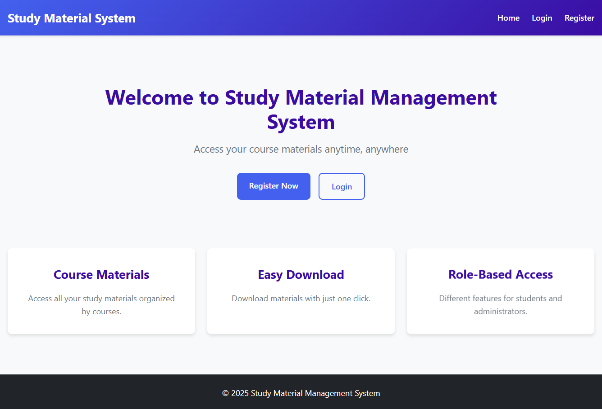

# Study Material System

A web-based application designed to facilitate the management and distribution of educational resources. This system allows administrators to manage courses and study materials, while students can easily access and download the resources they need.




## Features

### Admin Module
- **Dashboard**: Overview of system statistics.
- **Manage Courses**: Create, update, and delete courses.
- **Manage Materials**: Upload and organize study materials (PDFs, PPTs, etc.) for specific courses.
- **Manage Users**: overseeing student and admin accounts.

### Student Module
- **Dashboard**: View recent courses and materials.
- **Browse Courses**: Access a list of available courses.
- **Access Materials**: View and download study materials uploaded by administrators.
- **Profile Management**: Update personal details.

## Technology Stack

- **Frontend**: HTML, CSS
- **Backend**: PHP
- **Database**: MySQL

## Installation & Setup

1.  **Prerequisites**
    - Install a local server environment like XAMPP, WAMP, or MAMP.

2.  **Clone/Download**
    - Clone this repository or download the ZIP file and extract it to your server's root directory (e.g., `htdocs` in XAMPP).

3.  **Database Setup**
    - Open phpMyAdmin (usually at `http://localhost/phpmyadmin`).
    - Create a new database named `study_materials_db`.
    - Import the `study_materials_db.sql` file provided in the root directory of this project.

4.  **Configuration**
    - Open `includes/config.php` and verify the database connection settings:
      ```php
      define('DB_SERVER', '127.0.0.1');
      define('DB_USERNAME', 'root');
      define('DB_PASSWORD', '');
      define('DB_NAME', 'study_materials_db');
      ```
    - Update them if your local database configuration differs.

5.  **Run the Application**
    - Open your browser and navigate to `http://localhost/study-material-system` (or the folder name you extracted it to).

## Usage / Default Credentials

**Admin Account:**
- **Email:** `admin1@gmail.com`
- **Password:** `admin123`

**Student Account:**
- **Email:** `user1@gmail.com`
- **Password:** `user123`

## Directory Structure
- `admin/`: Admin-facing pages (courses, materials, users).
- `user/`: Student-facing pages (dashboard, download).
- `assets/`: CSS stylesheets and potential images.
- `includes/`: Common PHP files (header, footer, config).
- `uploads/`: Directory where study material files are stored.

## Author

- **Name:** Vimal Solanki
- **GitHub:** [solanki-vimal](https://github.com/solanki-vimal)